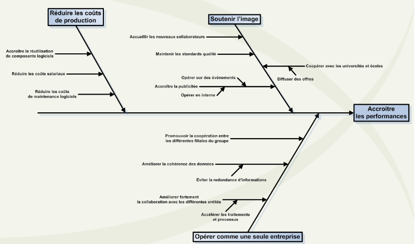
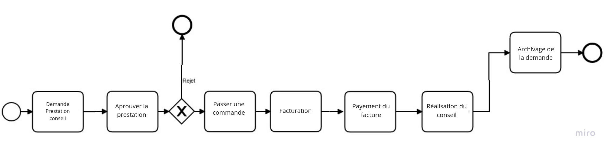
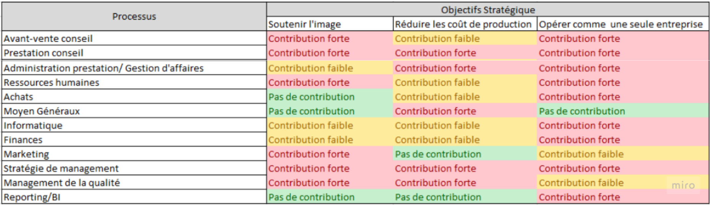
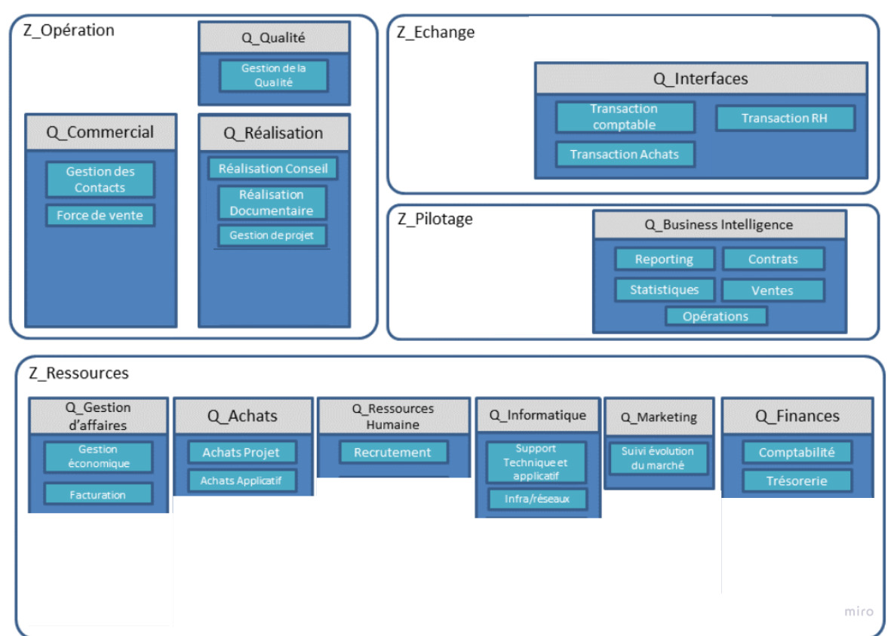
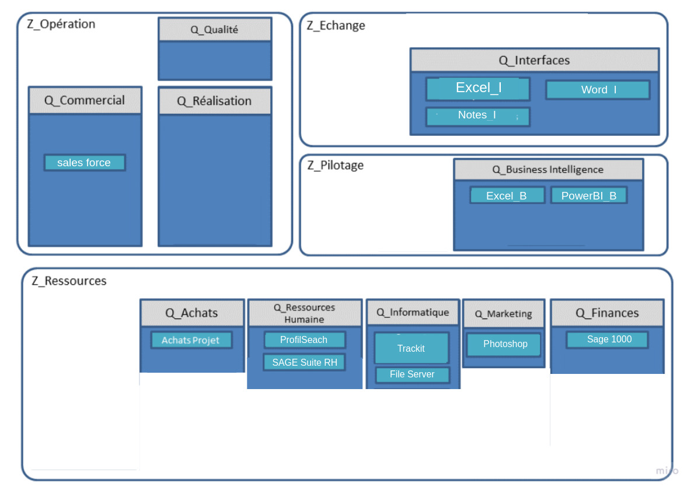
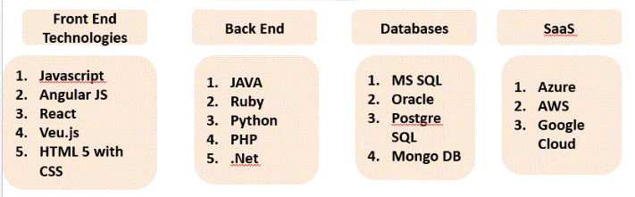

# introduction 

De nos jours, les entreprises se livrent à une concurrence féroce. Face à cela, elles cherchent à se protéger contre le principal risque, celui de leur disparition. Pour ce faire, les entreprises des pays développés ont adopté une nouvelle stratégie d’internationalisation car l’implantation dans les pays étrangers, à travers la création de succursales ou de filiales correspond de moins  en moins  à l’attente  compétitive des  entreprises.  Cependant,  elles cherchent à obtenir davantage de parts de marchés leur permettant ainsi d’accéder à une taille jugée optimale face à la concurrence d’autres grandes entreprises. Ainsi, les fusions ou les rachats d’entreprises locales semblent être un bon moyen pour résoudre plus facilement ce problème. Ce mouvement règne aujourd’hui dans tous les domaines (banques, aéronautique, société de services, etc.) et favorise le développement de grandes entreprises.  Par  extension,    cette  forte  évolution  des  activités  et  des  métiers  a  amené  les entreprises à développer leurs systèmes d’information afin que le phénomène de fusion-acquisition soit volontaire et  accompagné plutôt que d’être subi.  Ainsi, en intégrant les dimensions stratégiques et organisationnelles dans le système informatique, on garantit une cohérence globale forte à l’entreprise. Le present document comporte  une  analyse  du  système  d’information existant et la conception du nouveau SI de la société AKKA suite a l'equisition de l'entreprise Datarespons.

# PRÉSENTATION DE L’ENTREPRISE

## Group AKKA

AKKA Technologies accompagne les grands comptes industriels et tertiaires sur les différentes  étapes  de  leurs  projets,  de  la  Recherche  et  développement  (R&D) à l’industrialisation en passant par toutes formes d’études et d’analyses. Par la maîtrise de métiers complémentaires, le Groupe AKKA apporte une réelle valeur  ajoutée  à  ses  clients  tous  secteurs  confondus,  entre  autres, l’aéronautique, l’automobile, le spatial, le militaire, l’électronique Grand Public, les télécommunications, la chimie, la pharmacie, la sidérurgie, l’énergie, le ferroviaire, le naval, le tertiaire, etc. Grâce à la mobilité de ses  équipes et  à un  positionnement international,  AKKA Technologies intervient dans le monde entier sur des projets à la pointe de la technologie. Les sociétés du groupe totalisent plus de 10 000 collaborateurs et plus de cinquante implantations à travers le monde, réparties dans vingt-quatre pays, parmi lesquels on compte le Maroc, l’Allemagne, l’Amérique du Nord, la Belgique, E.A.U4, l’Espagne, la France, l’Italie, l’Inde, la Roumanie, le Royaume-Uni, la Suisse. L’offre du groupe AKKA Technologies, qui lui permet d’être présent sur l’ensemble du  cycle  de  vie  du  produit  (matériel  et  immatériel),  s’articule  autour  de  deux  métiers,l’ingénierie de conception et l’informatique & systèmes. Actif sur chacune des étapes de la vie des projets, AKKA décline les compétences de ses équipes sur six expertises : Ingénierie mécanique ,Ingénierie des processus ,Ingénierie documentaire ,Informatique industrielle & systèmes embarqués , Systèmes d’information , Conseil aux entreprises

## Socitee Datarespons
Data Respons est une société qui développe des systèmes embarqués dans les domaines du transport et de l'automobile, des télécommunications et des médias, de l'automatisation de l'industrie, de l'énergie et de la marine, des technologies médicales, de l'espace, de la défense et de la sécurité et de la finance et du public.La société a été acquis dernièrement par le groupe AKKA 

## Contexte de l’activité 
Le groupe AKKA souhaite lancer une réflexion afin d’évoluer vers un SI mutualisé.Pour cela, la connaissance et la maîtrise du SI existant doivent être assurées. Ainsi, l’approche urbanistique semble essentielle à la bonne réussite de l’objectif fixé par le groupe pour la réingénierie de son système d’information. De plus, le groupe pense à l’intégration d’un ERP au sein de son  SI  et  ainsi procéder  au décommissionnement  d’applications  jugées  obsolètes ou redondantes.Pour le faire, il  faudra,  dans  un  premier  temps,  analyser  la couverture fonctionnelle de cette ERP dans le paysage applicatif existant. Puis, dans un second temps, évaluer les efforts en termes d’intégration dans le projet d’urbanisation du SI. Ma mission s’inscrit dans ce contexte et se compose de deux grands axes, d’une part une partie étude comportant l’analyse de l’existant afin d’établir un bilan, d’autre part la réalisation concrète de l’évolution du SI de la société avec l’implantation d’un ERP. 
# LA VISION MÉTIER

## L’organisation et les processus actuels
Suite au rachat de la société Datarespons, le groupe AKKA a donc également récupérer  le  SI  de  cette  société.  Ainsi,  les  sous-systèmes  d’information du RH, Vente , CRM, Finance se retrouvent doublonnés et posent de réels problèmes de gestion des coûts et de maintenance. 

La figure au-dessus montre l’organisation du SI actuel pour le groupe AKKA Technologies et le découpage de celui-ci entre les différents pôles. Les deux systèmes d’information (Datarespons et AKKA) sont alors cloisonnés et dialoguent entre eux directement pour assurer une synchronisation.

## Modélisation des objectifs 

La première étape dans notre démarche  consiste à comprendre et représenter les objectifs stratégiques d’AKKA afin de décrire le premier niveau d’exigences, ce qui offrira une vue claire des enjeux stratégiques pour l’entreprise. Pour traduire les objectifs stratégiques du SI, nous avons décidé d’opter pour un diagramme d’Ishikawa. Les  urbanistes  ont  dérivé l’utilisation principale de ce diagramme en une représentation hiérarchique d’objectifs. La flèche centrale correspond à l’objectif majeur recherché, tandis que les sous-objectifs pour réaliser celui-ci sont représentés sous forme de flèches dirigées vers l’axe central.

Il apparait clairement que le sous-objectif d’opérer comme une seule entreprise  est essentiel pour accroître les performances du groupe.

## Modélisation des processus 

### Modélisation du processus de prestation de conseil

## Matrice Processus/objectifs 

# LA VISION FONCTIONNELLE

## La démarche de passage de la vision  métier vers la vision fonctionnelle

* Mettre en commun les informations internes   afin   d’optimiser   les échanges opérationnels du groupe 
* Créer  une  zone  «référentiel»  qui devra contenir un référentiel commun aux  entités
* Fournir les informations utiles et non redondantes aux services transverses (Qualité,  Finances,  Comptabilité, Gestion)

## Liste macroscopique des fonctions 

* Reporting
* Contrats
* Gestion des Proposition commercial
* Statistiques Ventes
* Gestion de projet
* Gestion de la qualité
* Transaction comptable
* Transaction comptable
* Transaction RH
* Transaction Achats
* Réalisation Conseil
* Gestion des Contacts
* Force de vente
* Réalisation Produit
* Gestion économique
* Recrutement
* Gestion documentaire
* Gestion des Contacts
* Support Technique et applicatif
* Infra/réseaux
* Suivi évolution du marché
* Comptabilité
* Trésorerie
* Planning ressources
* Facturation
* Gestion de l'immobilier
* Formation

## Structuration de la vision fonctionnelle

# LA VISION PPLICATIVE

## Architecture applicative existante

## Bilan de l’existant

### Problematique constatees

Malgré les problèmes générés par la stratégie d’expansion de l’entreprise (fusion, acquisition) et les différents systèmes d’information qu’elle doit par conséquent absorber, le groupe AKKA Technologies se doit de garantir une évolution  constante  de  son  SI.

On peut citer les problematiques suivantes:

* Les processus sont redondants entre les sociét
* Difficultés liées aux échanges entre processus issus de différentes sociétés
* Pas de référentiel commun aux différentes entités
* Le  découpage  fonctionnel  n’est  pas  clair.
* Des outils inadaptés qui, selon l’entité, ne remplissent pas toutes les fonctions du SI
* Beaucoup d’interfaces entre les applications qui posent des problèmes de maintenance et de fiabilité
* La  remontée  d’information  pour  l’informatique  décisionnelle  (BI)  est problématique et rend difficile le croisement et l’analyse des données du SI

## Architecture applicative cible 

# LA VISION TECHNIQUE

## Prise en compte des contraintes

Après avoir mis l'accent sur la vision applicative, la vision technique mis le point sur le matériel et infrastructure technique pour aider à la mise en place de l'architecture applicative. On présente ci dessous l'ensemble des constraints imposée:

* Les donnees du group AKKA et celle de la socitee acquis doivent etre centralisee pour permetre la synchronisation et la mise en temps reel des donnes.
* Il faut assurer l'interopérabilité entre les applications   en   conservant   une modularité.
* Il faut mettre en oeuvre un infocentre pour construire et enrichir   un   bus   de   données d’entreprise.

## Les choix logiciels : architecture par assemblage et support des standards

Le group AKKA pense a intégrer un ERP dans son systeme d'information.D'abord un ERP est une solution logicielle visant à unifier le système d’information d’une entreprise en intégrant les différentes composantes fonctionnelles autour notamment d’une base de données unique. D’autre mot, un ERP est un système complexe qui demande du temps à appréhender et mettre en place mais qui peut être extrêmement profitable à la rentabilité d’une entreprise.
La liste suivant present l'ensemble des technology qui sont tres connue pour le development des solution ERP (l'ordre est important) 

Cepandant il est interesant que la socite travail avec une solution deja existant comme odoo, iDempiere ,Netsuite. 

## Cartographie du système
